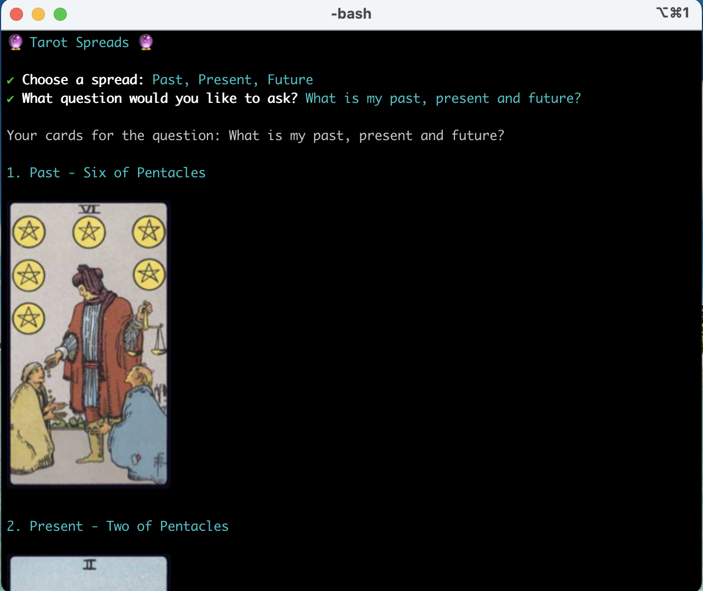

# Command Line Tarot Spreads

Command-line tarot spreads with card images. For full-resolution images, use iTerm or another terminal that supports inline images.

---

## Features

- Single card draw
- Three card spread – Past, Present, Future
- Five card spread
- **Celtic Cross** – full 10-card spread with standard positional meanings
- Rider-Waite card images and names

---

## 🚀 Installation

`npm install -g terminal-tarot`

## Usage

Run the command `tarot` to get started.

## Examples

